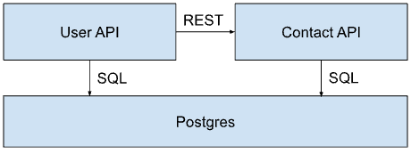

# Telepresence with Docker Compose

When it comes to developing an application, one of the potential friction points is your local setup. Several issues may arise:

- Tight security policies may be in place.
- The machine's operating system may differ significantly from the server's.
- Each individual has their own setup and way of working.

To address this challenge, platform engineers or developers themselves often resort to using a common solution that allows anyone to quickly start working on a project.

One common solution for this problem, is Docker, and more specifically, Docker Compose.

Both Docker Compose and Telepresence assist developers in working on their applications, although they serve different purposes:

- Docker Compose provides a highly customizable way of running an entire application locally.
- Telepresence enables combining a local environment within a remote cluster.

Let's explore how to harmonize these two approaches.

## A simple example

Let's start with a simple example and consider the following application :

- A user-api micro service,
- A contact-api micro service,
- A Postgres database.

The user API features an endpoint that retrieves user data, and in order to obtain the country information for each user, it makes additional requests to the contact API.

These microservices store their data in a PostgreSQL database.

Here is a schema summarizing the infrastructure:



And the equivalent docker-compose file.

```yaml
services:
  contactapi:
    build:
      context: .
      dockerfile: docker/contactapi/Dockerfile
    environment:
      DATASET: local
      DB_HOST: postgres
      DB_USERNAME: postgres
      DB_PASSWORD: postgresql
      PORT: 8081
    depends_on:
      - userapi
    ports:
      - 8081:8081

  userapi:
    build:
      context: .
      dockerfile: docker/userapi/Dockerfile
    environment:
      DATASET: local
      DB_HOST: postgres
      DB_USERNAME: postgres
      DB_PASSWORD: postgresql
      CONTACT_API_URL: "http://contactapi:8081"
      PORT: 8080
    depends_on:
      - postgres
    ports:
      - 8080:8080

  postgres:
    image: postgres:15-bullseye
    environment:
      POSTGRES_PASSWORD: postgresql
    ports:
      - 5432:5432
```

You can start your services locally with compose by running:

```cli
git clone https://github.com/datawire/telepresence-compose-demo
cd telepresence-compose-demo
docker compose up
```

You can test your service with:

```cli
curl localhost:8080/users
```

As you can see, it only contains one test user, that's the local database.

Press `Ctrl + C` to shutdown the Compose run.

## Going Kubernetes

Now, lets assume you have the equivalent services running within Kubernetes.

You can find the configuration in the [repository](https://github.com/datawire/telepresence-compose-demo/tree/knlambert/blog-post/infra), and create it with:

```cli
# Create a namespace (feel free to change its name)
kubectl create namespace telepresence-compose-demo
kubectl apply -f infra -n telepresence-compose-demo
```

And this is what the resulting infrastructure:

```cli
> kubectl get svc -n telepresence-compose-demo
NAME         TYPE        CLUSTER-IP      EXTERNAL-IP   PORT(S)    AGE
contactapi   ClusterIP   10.43.218.155   <none>        80/TCP     6h16m
postgres     ClusterIP   10.43.139.200   <none>        5432/TCP   6h16m
userapi      ClusterIP   10.43.154.149   <none>        80/TCP     6h16m

> kubectl get pods -n telepresence-compose-demo
NAME                          READY   STATUS    RESTARTS   AGE
postgres-7976596b89-wfnp6     1/1     Running   0          6h16m
contactapi-7d8688b987-4hk2l   1/1     Running   0          6h16m
userapi-687ffc88b6-bfthc      2/2     Running   0          4h59m

> telepresence connect -n telepresence-compose-demo --docker
> telepresence list
contactapi: ready to intercept (traffic-agent not yet installed)
postgres  : ready to intercept (traffic-agent not yet installed)
userapi   : ready to intercept (traffic-agent not yet installed)
```

How can you test your compose file against these services ?

Typically, you have two options: either you continuously test everything locally, ensuring it closely resembles the real setup, or you maintain a separate test environment in a different namespace where you can update the pod with your test version.

This is where Telepresence can be extremely beneficial for your setup, particularly because it offers integration with Docker Compose.

## The Telepresence specification

### Basic knowledge

Telepresence supports a YAML document that allows you to create a consistent and repeatable environment: The Intercept Specification.

It has three sections :

- `connection`: This one is optional, but it allows you to define which Kubernetes context the spec should be used with.
- `workloads`: It defines the workloads to intercept, and how (header, ports, ...).
- `handlers`: The local service that will handle the intercepted traffic from the workload.

Consider this specification file:

```yaml
connection:
  namespace: telepresence-compose-demo # Consider your local setup moved to this namespace.
workloads:
  - name: userapi
    intercepts:
      - handler: userapi # Matches the handler's name.
        global: true
        previewURL: false
        port: 80 # The corresponding Kubernetes service uses the port 80.
        localPort: 8080 # The local container uses port 8080.
handlers:
  - name: userapi
    docker:
      build:
        context: ./
        args: # Build the docker image on the fly.
          - --file
          - ./docker/userapi/Dockerfile
```

Setting the namespace in the connection field, means that any container you'll define in this file, will be
able to communicate with the cluster as if it was actually located there.

We indicate that the `userapi` workload needs to be intercepted. It means that any request going to this service
will be redirected to your local container (we call that a global intercept, but you could also do it for a subset of the
traffic [using a personal intercepts](https://www.getambassador.io/docs/telepresence/latest/howtos/personal-intercepts#personal-intercepts)).

Then we define the handler that will receive the traffic. In this case, we use `userapi`'s Dockerfile.

Now let's run that spec:

```cli
> telepresence intercept run telepresence.spec.yaml
   Intercept name    : userapi
   State             : ACTIVE
   Workload kind     : Deployment
   Destination       : 127.0.0.1:8080
   Volume Mount Point: /var/folders/x_/4x_4pfvx2j3_94f36x551g140000gp/T/telfs-3467079569
   Intercepting      : all TCP requests
   Layer 5 Hostname  : userapi.telepresence-compose-demo.svc.cluster.local
Intercept spec "telepresence.spec" started successfully, use ctrl-c to cancel.
Attempt 1: Checking PostgreSQL connection...
PostgreSQL is ready!
2023/11/01 20:11:24 Listening on 8080
```

If you hit the real endpoint, you will see the traffic in the logs above. You can get access to it
through its external IP:

```cli
> kubectl get svc userapi -n telepresence-compose-demo
NAME      TYPE        CLUSTER-IP    EXTERNAL-IP    PORT(S)   AGE
userapi   ClusterIP   10.43.25.37   x.x.x.x        80/TCP    56m
```

If you don't have any load balancer to expose your service, you can still
port-forward the service :

```cli
kubectl port-forward svc/userapi 9090:80 -n telepresence-compose-demo
curl localhost:9090/users
```

Or attach a container to the Telepresence daemon :

```
NAMESPACE="telepresence-compose-demo-cn"
docker run -ti --rm \
  --network=container:tp-$(kubectl config current-context)-${NAMESPACE} \
  travelping/nettools curl userapi/users
```

It should return the data from the Kuberentes cluster, since it uses
the remote Database:

```cli
[{"id":1,"name":"kevin","contact":{"country":"CANADA"}},{"id":2,"name":"jake","contact":{"country":"US"}},{"id":3,"name":"guillaume","contact":{"country":"CANADA"}},{"id":4,"name":"nick","contact":{"country":"US"}},{"id":5,"name":"thomas","contact":{"country":"SWEDEN"}},{"id":6,"name":"jose","contact":{"country":"CANADA"}}]
```

Then execute `Ctrl + C` or `telepresence quit` in another terminal to stop the specification.

### Compose integration

We can modify the specification so that the handler is not a Docker image but a Compose spec.

You can set the path to your Compose file and target the services to use (or not) by simply changing the handlers.

This is equivalent to the previous specification:

```yaml
[...]
handlers:
 - name: userapi
   docker:
     ports:
       - 8080
     compose:
       services:
         - name: userapi
           behavior: interceptHandler

         - name: contactapi
           behavior: remote

         - name: postgres
           behavior: remote
```

Each service has a behavior which can be tweaked.

- local: The service will run locally without any modifications. This is the default.
- remote: Meaning that Telepresence won't start the container, but so that you can use the real one in the
  Kubernetes cluster.
- interceptHandler: The service runs locally and will receive traffic from the intercepted pod. Also, Telepresence
  will inject volumes and environment variables from the real pod.

Try to run it with:

```cli
telepresence intercept run telepresence-compose-remote.spec.yaml
```

If you try to request the endpoint again, it should the same data than the previous specification, since they
are equivalent.

You can also mix the service behavior: Let's make the ` userapi` run in the cluster, while still having `contactapi` and `postgres` locally:

```yaml
[...]
handlers:
  - name: userapi
    environment: # Override the env vars to use the local values.
      - name: DB_HOST
        value: postgres
      - name: DATASET
        value: local
      - name: CONTACT_API_URL
        value: http://contactapi:8081
    docker:
      ports:
        - 8080
      compose:
        services:
          - name: userapi
            behavior: interceptHandler

          - name: contactapi
            behavior: local

          - name: postgres
            behavior: local
```

This spec will run the `userapi` in the intercepted pod context, but will keep the rest in Compose locally.

Note that by default, during an intercept, all the pod's environment variables are injected into `userapi`, so we need to override them to force `userapi` to target the local `postgres` & `contactapi`.

You can try it with:

```cli
telepresence intercept run telepresence-compose-local.spec.yaml
```

And if you request your app again, it should now return the local values:

```cli
[{"id":1,"name":"local-dummy-dao","contact":{"country":"US"}}]
```

## Tips

### Embedded Docker Compose specification

You don't have to keep the Docker Compose spec in a different file, and can include it directly in the
Intercept spec:

```yaml
[...]
handlers:
  - name: userapi
    docker:
      ports:
        - 8080
      spec:
        services: {} # Paste your Docker Compose specification here.
      compose:
        services:
          - name: userapi
            behavior: interceptHandler

          - name: contactapi
            behavior: remote

          - name: postgres
            behavior: remote
```

### Expose your app to your host

Since everything runs inside a Docker Network isolated fromn your machine, you won't be able
to request the app running locally from the browser.

Although, Telepresence has an option to expose it by setting the `ports` parameter under the `docker` configuration:

```yaml
handlers:
  - name: userapi
    docker:
      [...]
      ports:
        - 8080 # Port to expose to your host.
```
